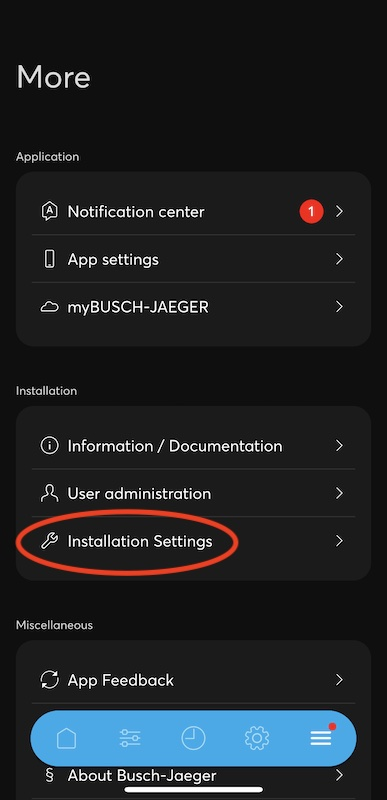
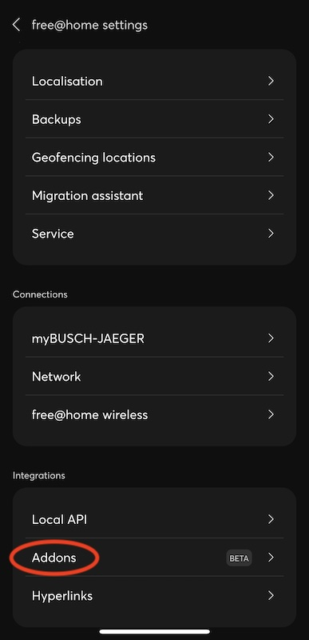
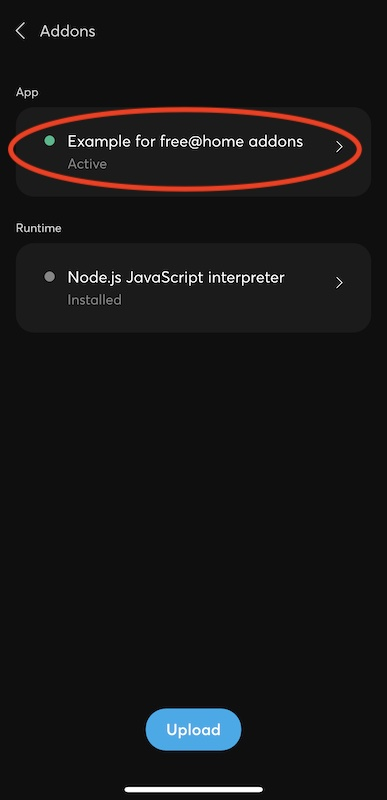

## Getting started with ABB free@home Addons

------------------------------------------------------------------------

This section is meant to get you started quickly with ABB free@home Addon development.

### Prerequisites

- You need a free@home System Access Point version at least 3.0.0

- The System Access Point must be in your local network, i.e. your development machine must be able to access it.
  Access through the free@home cloud is not possible. You can setup a VPN though, however this is
  beyond the scope of this document)

- Activate the `Local API` in your System Access Point settings, see the
  [prerequisites](Prerequisites) for details

- Basic knowledge of javascript / typescript is required

- Install [node.js](https://nodejs.org/en/download/) to your development machine

- An IDE with typescript support is recommended, this walkthrough uses and recommends
  [Visual Studio Code](https://code.visualstudio.com/download)

Please refer to [prerequisites](Prerequisites) for details.

### Overview

The required steps in this walkthrough are:

1. Obtain the example addon, along with the free@home js library and tools

2. Import the example to your IDE and run it on your development machine

3. Modify the example to your needs

4. Deploy the example to your System Access Point

This example will create virtual devices that can be controlled directly in the free@home next apps.
The System Access Point will send the changes to the device ("on"/"off") to the addon running on your development
machine, but otherwise the devices will behave in free@home like real devices.

### Obtain the example ABB free@home Addon

In this walkthrough we use the node-free∆home-example example addon. This example consists of three parts:

- The free-at-home js library that provides functions to create (virtual) devices and control them.

- The free-at-home-cli command line tool that is used to build the addon archive file.

- The js source code for the actual addon.

Use the template example from [here](https://github.com/Busch-Jaeger/node-free-at-home-example) and clone the repository to your development machine.

Next, open the folder in a command line and type

```shell
npm install
```

This will download (if needed) any dependencies and install the required packages, most notably the
`@busch-jaeger/free-at-home` package, into this example directory.

### Import the example to your IDE

The extracted example contains a sample configuration for
[Visual Studio Code](https://code.visualstudio.com/). You can of course use whatever development
environment you prefer, however in this walkthrough we will use Visual Studio Code. If you use
something else, please adjust the IDE-specific steps accordingly. If you run into trouble, please
first try to follow this Visual Studio Code based example first and see if the problem also exists
there.

1. Open Visual Studio Code, and select `open folder`, there pick the folder of demo package
   extracted beforehand.

2. Adjust the configuration for your development System Access Point:

   1. Copy the file `launch.json.example` in the subfolder `.vscode` to `launch.json` in the same folder.

   2. Open the file `launch.json` in the subfolder `.vscode`. This configuration will be used by
      Visual Studio Code when starting the addon.

   3. Find and edit the settings `FREEATHOME_API_USERNAME` and
      `FREEATHOME_API_PASSWORD`. These must be set to the address of the local API on your System Access Point,
      the username on that System Access Point that provides the local API, and the password of that user.
      ```
            "FREEATHOME_BASE_URL": "http://192.168.x.x",              (IP Address of the System Access Point)
            "FREEATHOME_API_USERNAME": "installer",                   (Username shown for local API in the free@home NEXT app)
            "FREEATHOME_API_PASSWORD": "12345"                        (Password shown for local API in the free@home NEXT app)
      ```

      These environment variables will be used by the addon when starting it on your development
      machine to contact the REST API ("local API") on the System Access Point. It will not be needed when
      deploying the final addon directly onto the System Access Point.

Next, take a look at the `main.js` file in the `src` directory of the example. This is the full
addon code:

- Notice that this example uses the `@busch-jaeger/free-at-home` library. This library is provided for addons and
  does the heavy lifting of communicating with the System Access Point and provides a convenient TypeScript API
  for this.

- The `main` function creates two virtual devices, a simple `switch` actuator (i.e. a devices that
  acts as a switch with "on" and "off" states), and a `dimmer` actuator (i.e. a devices that
  additionally has a "value" percentage.

- The devices simply output their state to the js console. A real addon would normally replace this
  implementation.

Finally, run the example in vscode (`Run -> Start Debugging`). Keep in mind that the `Local API`
must have been activated on the System Access Point for this step, see the
[prerequisites](prerequisites) for details. If successful, your System Access Point should now
provide the new devices.


Open the `House Structure` on your System Access Point and place the devices into rooms,
then they can be used normally. When switching the devices using the app, you should now see
corresponding console output in the `Debug Console` pane of Visual Studio Code.

### Modify the example

At this point, the addon is set up complete. You can now open the `main.js` file and adjust it to
your needs, for example change the name of the devices and observe the changes in the app.

### Deploy the ABB free@home Addon to the System Access Point

When the addon is set up as desired, the final step is to build an addon archive file and deploy
it to the System Access Point. Then the addon will directly run on the System Access Point instead of your local development
machine. The REST interface to the System Access Point that is used by the addon remains the same, so no
additional changes are required.

Refer to [deployment](deployment) for a more detailed deployment documentation. Steps
for this example:

0. Make sure to stop the addon in your IDE first.

1. Open the file `free-at-home-metadata.json` in the root folder of the example and edit it to your
   needs, most notably the `name` and `version` fields. If you just want to test the deployment, you
   can leave this file as-is.

2. Open the example directory in a command line terminal / console of your IDE (e.g. the `Terminal`
   pane in vscode).

3. Run
  ```shell
  ./node_modules/.bin/free-at-home-cli buildscriptarchive build
  ```

  This will output a new file `<id>-<version>.tar` in the example root folder, matching the `id` and
  `version` specified in `free-at-home-metadata.json`. This is the final addon that can be uploaded
  to the System Access Point.

4. Upload the file to your System Access Point, for example using a webbrowser in the `Addons` section of the
   settings.

   Alternatively, you can use the `free-at-home-cli` tool in a command line terminal for
   convenience, assuming you also set the `FREEATHOME_BASE_URL`, `FREEATHOME_API_USERNAME`,
   `FREEATHOME_API_PASSWORD` environment variables:

   Linux/Mac:
   ```bash
   export FREEATHOME_BASE_URL=http://[IP of System Access Point]
   export FREEATHOME_API_USERNAME=[System Access Point username that activated local API]
   export FREEATHOME_API_PASSWORD=[Password of user]
   ./node_modules/.bin/free-at-home-cli upload
   ```

   Windows:
   ```
   $env:FREEATHOME_BASE_URL = 'http://[IP of System Access Point]'
   $env:FREEATHOME_API_USERNAME = '[System Access Point username that activated local API]'
   $env:FREEATHOME_API_PASSWORD = '[Password of user]]'
   ./node_modules/.bin/free-at-home-cli upload
   ```

If successful, the `Addons` section in the free@home settings should now display your addon.
Make sure it is displayed as `Active`, otherwise it must be manually started.




