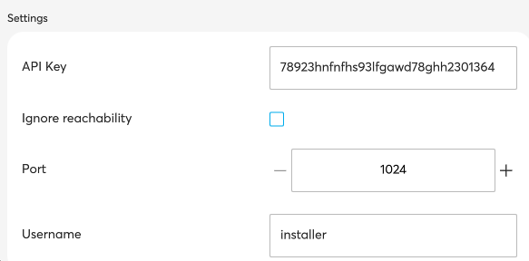
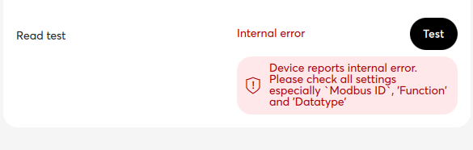

## ABB free@home Addon Metadata

Every ABB free@home Addon contains one special file `free-at-home-metadata.json`, which describes the
Addon itself. When a new Addon is added to the system access point, it will look at this file to
determine how to handle the Addon and what should be displayed to the end-user in the UI of the
free@home next app (and similarly, the Web interface of the system access point).

### Metadata attributes

The `free-at-home-metadata.json` file contains a JSON object with the following entries.
Note that the attributes marked as `required` **must** be present for every Addon, while the
attributes marked as `optional` can be omitted, if it provides no benefit for the given Addon.

- `id` (required)

  A unique identifier for an Addon. The developer must chose an id such that it does not conflict
  with any other Addon that the user may want to install. The value uses a typical reversed domain
  name, e.g. an Addon `example1` written by Busch-Jaeger would use `de.busch-jaeger.freeathome.example1`.

  Typically you would use your own company name here, or real-name if no company name is available.
  Note that it is preferred to use an actual domain name (in reverse notation), but not a
  requirement, i.e. the domain name does not have to actually exist.

- `name` (required, can be localized)

  A human readable name of the Addon.

  This name is shown in the free@home next app and in the System Access Point Web interface. The name is displayed
  in the list of installed Addons - it should be relatively short, so that the end-user can
  recognize each Addon immediately.

  This attribute can be localized. Instead of a simple string, you can use a JSON object, providing
  a different value for each language (though the "en" language always must be present and is used
  as a fallback). For example:

  ```json
  {
    "name": "Sample Addon"
  }
  ```

  localized:

  ```json
  {
    "name": {
      "en": "Sample Addon",
      "de": "Beispiel Addon"
    }
  }
  ```

  The full list of valid language codes for a given System Access Point version can be obtained from the swagger
  documentation on `http://<IP of System Access Point>/swagger` in the `/rest/ref/{reference}` call of the Add-on
  API.

- `description` (required, can be localized)

  A human readable description of the ABB free@home Addon. This is similar to the name, but allows
  for a longer text. It is display in the free@home next app and in the System Access Point web interface when
  the user clicks
  on the ABB free@home Addon.

  Similar to the `name`, the description can be localized. See the documentation of `name` for
  details.

- `version` (required)

  The version of this Addon. This is displayed in the free@home next app and in the
  System Access Point Web interface.

- `entryPoint` (required)

  This should normally be set to `build/main.js` and is the
  relative path from the root of the archive to the main JavaScript file.
  This file is executed by Node.js.

- `license` (required)

  What license your Addon should be published under.

- `type` (required)

  Can be one of "app", "runtime" and "standalone". For Addons, always set this to "app".

- `author` (required)

  The name of the author of this Addon.

- `url` (required)

  If there is a website where the user can find additional information about your Addon, you can
  add the link here.

- `minSysapVersion` (optional, since System Access Point version 3.1.0)

  The minimum version of the system access point required by this Addon, for example "3.1.0". A
  System Access Point that prior to version 3.1.0 will ignore this.

- `parameters` (optional)

  This attribute can contain a JSON object containing additional parameters of your Addon.
  The end-user of the Addon can set the values of the parameters listed here to custom values, this
  can be used to configure the Addon for a specific user. One possible example use for this is
  address, username and password of an external device that should be controlled by the Addon.

  See the dedicated [parameters](Metadata#abb-freehome-addon-parameters) section below for details.

- `wizards` (optional)

  This attribute can contain a JSON object that define wizards that help the user to configure the parameters.

  See the dedicated [wizards](Metadata#abb-freehome-addon-wizards) section below for details.

A sample metadata JSON file looks like this:

```json
{
    "name": "Example for ABB free@home Addons",
    "version": "1.0.0",
    "id": "de.busch-jaeger.freeathome.example",
    "license": "MIT",
    "description": "Example for ABB free@home Addons",
    "url": "http://busch-jaeger.de",
    "author": "Busch Jaeger",
    "type": "app",
    "entryPoint": "build/main.js"
}
```

### ABB free@home Addon parameters

Some Addons will be able to run out of the box without any parameters. In those cases, the
parameters attribute in the metadata file is not needed at all.

However in many cases, the Addon needs to be adjusted to the environment of the end-user, or the
Addon may want to allow the user to configure some aspects of the Addon. This is what parameters are
used for.

A common use-case would be an Addon that adds an external device to the free@home system. Imagine an
external device, for example a smart switch, that offers a REST interface to send commands to this
device. The Addon can be written such that the "switch off" or "switch on" REST command is sent
whenever the end-user clicks the corresponding command in the free@home app. However this is only
possible when the Addon knows some data that is only available to the end-user, such as:

- The IP address (and possibly the port) of the device in the local network of the end-user
- The username and password (or similar data) of the REST interface, if the device requires
  authentication

To do this, the Addon can add these as parameters in the `free-at-home-metadata.json` and let the
user configure them after installing the Addon:

```json
{
    ...
    "parameters": {
        "default": {
            "name": "Settings",
            "items": {
                "address": {
                    "name": "Address",
                    "type": "ipv4"
                },
                "port": {
                    "name": "Port",
                    "type": "number",
                    "min": 1024,
                    "max": 65535
                },
                "username": {
                    "name": "Username",
                    "type": "string"
                },
                "password": {
                    "name": "Password",
                    "type": "password"
                }
            }
        }
    }
}
```

With this file, the free@home next App and the System Access Point web interface will display `Address`, `Port`,
`Username` and `Password` fields in the settings of the Addon and let the end-user configure them.



All parameters can show additional information to explain what the user can configure with it by adding an optional `description`, e.g.

```json
"address": {
    "name": "Address",
    "description": "Enter the IP address of the server.",
    "type": "ipv4"
}
```

#### Translatable attributes

Some attributes inside the parameter definition can be defined for multiple languages. Those are `name` and `description`. Example:

```json
"address": {
    "name": "Address",
    "name@de": "Adresse",
    "description": "Enter the IP address of the server.",
    "description@de": "Geben Sie die IP-Adresse des Servers ein.",
    "type": "ipv4"
}
```

#### Types

What type of input field is displayed to the user, depends on the `type` attribute and depending on the `type`, possibly additional data (most notably `min` and `max`, specifying the range and `default` for the default value to use). The `name` is what is displayed to the user for this parameter.

Possible types are:

##### Editable types

- `number`

  This type has additional `min` and `max` fields, specifying the range of valid values.

- `string`

  The user can enter a normal string here.

- `multilinestring`

  The user can enter a string with multiple lines here.

- `password`

  Similar to `string`, but will be displayed as password instead, i.e. the text is not visible in clear text when displayed to the user.

- `boolean`

  This will display a checkbox that can either be checked or unchecked.

- `ipv4`

  This type allows the user to enter an IPv4 address.

- `date`

  The user can enter a date here.

- `time`

  Shows a time field where the user can enter a time value in format `HH:MM`

- `weekdays`

  The user can select weekdays here. The result value is a string with a concatenated list of weekday numbers (1 = Monday to 7 = Sunday), e.g. a selection
  of Tuesday, Thursday and Saturday would result in a value of "246".

- `select`

  > **NOTE:** Requires free@home app version >= 2.4.0

  Shows a list of values to select one. The list of selections has to be added as `options`:

  ```json
  "meterType": {
      "name": "Type",
      "type": "select",
      "options": [
          {"key": "main-meter", "name": "Main meter"},
          {"key": "sub-meter", "name": "Consumer meter"},
          {"key": "inverter", "name": "Inverter"},
          {"key": "battery", "name": "Battery"}
      ]
  }
  ```

  The `name` attribute in the options is also translatable:

  ```json
  {"key": "main-meter", "name": "Main meter", "name@de": "Hauptzähler"},
  ```

- `floor`

  > **NOTE:** Requires free@home app version >= 2.4.0

  Shows a list of floors to select one.

- `room`

  > **NOTE:** Requires free@home app version >= 2.4.0

  Shows a list of rooms to select one.

- `channel`

  Shows a list of free@home channels to select one.

- `scanQRCode`

  Shows a text-field where you can enter a code manually or scan it from
  an QR-Code.

- `jsonSelector`

  > **NOTE:** Requires free@home app version >= 2.4.0

  Allows the user to select a value from a complex json object. Example:

  ```json
  "power": {
      "name": "Power",
      "type": "jsonSelector",
      "json": {
        "ENERGY": {
          "Power": 10,
          "EnergyTotal": 678,
          "EnergyToday": 5
        }
      }
  }
  ```

  If the user selects the `Power` entry, the stored value would be the path to that value: `Energy.Power`.  

##### Read-only types

- `text`

  The specified text is displayed to the user.

- `button`

  Shows a button that sends an event of type `buttonPressed` event to the Addon.

- `error`

  > **NOTE:** Requires free@home app version >= 2.4.0

  Like `text` but the content is displayed with red color.

- `separator`

  Shows a horizontal line. Can be used to separate a some parameters from others. If you add a `name` it is shown as a title for this groups, if you add a `description` it is shown as text below the title.

- `displayQRCode`

  Shows the value as QR-Code.

- `svg`

  > **NOTE:** Requires free@home app version >= 2.4.0  

  Shows the value as SVG-Image in the UI.

- `uuid`

  > **NOTE:** Requires free@home app version >= 2.4.0

  Only useful for parameter groups with `multiple: true`. The UI generates a UUID when a new entry is created. This UUID can be used to identify the entry.

##### Custom types

  > **NOTE:** Requires free@home app version >= 2.4.0  

For more complex parameter values you can define custom types. Those types are defined in an extra `types`-section of your metadata and have the same
syntax as a parameter group with just two differences:

1. The `display` attribute is required
2. The `multiple` attribute is not allowed

Basic exampe:

  ```json
  "parameters": {
    "example": {
      "name": "Custom example",
      "items": {
        "register": {
            "name": "Register",
            "type": "custom",
            "customTypeName": "modbusRegister"      
        }
      }
    }
  }
  "types": {
     "modbusRegister": {
        "name": "Modbus register",
        "name@de": "Modbus-Register",
        "display": {
            "title": "$address",
            "error": "$errorMessage"
        },
        "items": {
            "function": {
                ...
            },
            "address": {
              ...
            }
            ...
        }
     }
  }
  ```

#### Additional parameter attributes

Beside the already explained `name`, `type` and `description` attributes there are some special attributes that can be optionally added to a parameter definition:

- `required`

  If this is added with a `true` value this parameter value is required. The user can not save the settings unless this parameter has a value.

- `default`

  > **NOTE:** Requires free@home app version >= 2.4.0

  Specifies a default value for this parameter.

- `event`

  The value of this parameter is not saved in the settings but send as an event when the user clicks on the send button that is show underneath this parameter.

- `eventScope`

  Defines the amount of information that is sent in the `event`.

  `eventScope: parameter`: [default] sends only the current value of this parameters.
  `eventScope: group`: sends the current values of all parameters of the same group.
  

- `visible`

  > **NOTE:** Requires free@home app version >= 2.4.0

  Show/Hide this parameter in the UI. (default: `true`)

- `preFill`

  > **NOTE:** Requires free@home app version >= 2.4.0

  Prefill this value with the last edited one (or one from another config entry of this group). (default: `false`).

- `saveOnChange`

  > **NOTE:** Requires free@home app version >= 2.4.0

  When this is true the every change of the parameters value will be saved immediately (default: false)

- `dependsOn`

  > **NOTE:** Requires free@home app version >= 2.4.0

  Allows to define that a parameter is only shown, when another parameter has a specific value. Also requires the additional `dependsOnValues` attribute. Example:

- `fixed`

  > **NOTE:** Requires free@home app version >= 2.4.0

  A fixed value can only be edited when a new configuration entry of an multiple parameter group is created. Once this value is saved, it cannot be changed. You have to delete the entry and create a new one, if you want to change this value.

  ```json
  "connectionType": {
      "name": "Connection",
      "type": "select",
      "required": true,
      "options": [{"key": "USB"}, {"key": "MQTT"}],
  },
  "mqttType": {
      "name": "MQTT type",
      "type": "select",
      "options": [
        {"key": "generic", "name": "Generic"}, 
        {"key": "tasmota", "name": "tasmota"}
      ],
      "dependsOn": "connectionType",
      "dependsOnValues": ["MQTT"]
  }
  ```

  In this example the `mqttType` parameter is only shown when the `connectionType` parameter has the value `MQTT`. `dependsOnValues` is an array of possible values to check.

  - `dependsOnConfig`

    Replaces other settings in this parameter configuration when one of the values matches. The former example using `dependsOnValues` in only a shortcut for:

  ```json
  "connectionType": {
      "name": "Connection",
      "type": "select",
      "required": true,
      "options": [{"key": "USB"}, {"key": "MQTT"}],
  },
  "mqttType": {
      "name": "MQTT type",
      "type": "select",
      "options": [
        {"key": "generic", "name": "Generic"}, 
        {"key": "tasmota", "name": "tasmota"}
      ],
      "visible": false,
      "dependsOn": "connectionType",
      "dependsOnConfig": [
        { "values": "MQTT", "visible": true }
      ]
  }
  ```

    Most of the configuration options can be overridden this way, but there are exceptions. You cannot change `type`, `dependsOn`, `dependsOnValues`
    and `dependsOnConfig`.

    Another example of a common use case for this feature is the replacement of options in a select-type parameter.

  ```json
  "meterType": {
        "name": "Type",
        "type": "select",
        "required": true,
        "options": [
            {"key": "main-meter", "name": "Main meter"},
            {"key": "sub-meter", "name": "Consumer meter"},
            {"key": "inverter", "name": "Inverter"},
            {"key": "battery", "name": "Battery"},
            {"key": "gas-meter", "name": "Gas meter"},
            {"key": "water-meter", "name": "Water meter"}
        ]
    },
    "connectionType": {
        "name": "Connection",
        "type": "select",
        "required": true,
        "options": [{"key": "USB"}, {"key": "MQTT"}],
        "dependsOn": "meterType",
        "dependsOnConfig": [
              {
                "values": ["gas-meter", "water-meter"], 
                "options": [{"key": "MQTT"}]
              }
        ]
    }
    ```

    In this example the `connectionType` shows the options `"options": [{"key": "MQTT"}]` when `meterType` has the value `gas-meter` or `water-meter`.

- `debug`

  > **NOTE:** Requires free@home app version >= 2.4.0

  If this is added with a `true` value this parameter is only shown, when the app is in debug mode and the 'Enable Addon debug settings' checkbox is checked in the debug menu.

- `rpc`,  `rpcCallOn`, `rpcAdditionalParameters`

  > **NOTE:** Requires free@home app version >= 2.4.0

  Allows retrieving the value or configuration changes for this parameter from the addon via one of two RPCs: `getParameterValue`, `getParameterConfig`.

  With `rpcCallOn` you can define when this rpc is send:
  
  `rpcCallOn: initial`: sends it only once when the UI opens the addon settings.

  `rpcCallOn: everyChange`: sends it every time any of the other parameter values in the same group has been changed by the user.

  `rpcCallOn: buttonPressed`: Only for parameters that have `sendAsEvent: true`. Executes the rpc when the send button has been pressed.

  `rpcAdditionalParameters`: is just an optional set of values that are added to the rpc.

  Full example: If you have a parameter group that configures something that can be explained best with a graph (e.g. a dimming curve or a color temperature calculation that changes over the day) you can use the `svg` parameter type together with these rpc settings to show the user a graph based on your current parameter settings.

  ```json
    "configs": {
      "name": "Configuration",
      "name@de": "Konfiguration",
      "multiple": true,
      "display": {
          "title": "$name"
      },
      "items": {
        ...
        "curve": {
          "name": "Color temperature curve today",
          "name@de": "Farbtemperaturkurve heute",
          "type": "svg",
          "rpc": "getParameterValue",
          "rpcCallOn": "everyChange",
          "rpcAdditionalParameters": {
              "width": 600,
              "height": 300
          }
      }
    }
  }
  ```

  The addons receives the rpc everytime any other parameter of the same groups changes. The parameters of the rpc contains all parameter values of the current group and in addition to that `"parameter": "curve"`, `"group": "configs"` and whats configured in `rpcAdditionalParameters`.
  With all these values the addon can generate an SVG-Chart and send it as response. That chart will be shown to the user and he gets live feedback to every configuration changed by seeing an updated curve.

#### Parameter groups

If an Addon provides many parameters, grouping them may be useful.
In the `free-at-home-metadata.json`, each parameter must be in a group - in the example above, there
is only one group, named `default` and the name of the group displayed to the user is `Settings`.

Normally you can simply keep this structure. However if needed, you can add additional groups, for
example to configure authentication parameters in a `Authentication Settings` group and advanced
settings that the user will normally not changed in an `Advanced Settings` group:

```json
{
    ...
    "parameters": {
        "authentication": {
            "name": "Authentication Settings",
            "items": {
                "username": {
                    "name": "Username",
                    "type": "string"
                },
                "password": {
                    "name": "Password",
                    "type": "password"
                }
            }
        },
        "advanced": {
            "name": "Advanced Settings",
            "items": {
                "pollinginterval": {
                    "name": "Polling interval (seconds)",
                    "type": "number",
                    "min": "2",
                    "max": "2000",
                    "value": "10"
                }
            }
        }
    }
}
```

If you need multiple configuration entries for a parameter group you can add `"multiple": true` to it.

If you have many parameter groups or a group with many parameters in it the UI can be a bit confusing. To avoid that you can show a list item
instead of the complete form of a configured parameter group entry. When the user clicks on that list item the form is opened. For the
example above you can show the configured username in that entry with this configuration:

```json
"authentication": {
    "name": "Authentication Settings",
    "display": {
      "title": "Username: $username",
    }
    "items": {
        "username": {
            "name": "Username",
            "type": "string"
        },
        "password": {
            "name": "Password",
            "type": "password"
        }
    }
},
```

You can use any parameter value from the groups `items` list in the display title by prepending its name with a `$`.
If the `username` is not set the title is not shown. In additions to the `title` you can also add a second line with `subtitle`
and an error line with `error`, a full example would be:

```json
"display": {
    "title": "$meterType: $topic",
    "subtitle": "Connection: $state",
    "subtitle@de": "Verbindung: $state",
    "error": "$errorMessage"
},
```

The display feature is mostly useful for parameter groups with the multiple flag. You are also able to modify the values of `title`, `subtitle` and
`error` depending on values of other parameters in this group. This is familiar with the `dependsOnConfig` feature of a parameter but uses a slightly
different syntax. Example:

```json
"display": {
    "title": "$meterType: $topic",
    "subtitle": "Connection: $state",
    "subtitle@de": "Verbindung: $state",
    "error": "$errorMessage",
    "dependsOn": {
      "topic": [{"values": [""], "title": "Unconfigured", "title@de": "Unkonfiguriert"}]
    }
},
```

In this case the display title will show "Unconfigured" when the topic is empty.

#### Using parameters in an ABB free@home Addon

When parameters are defined in the metadata file, they can be accessed from the TypeScript code in
the Addon. The configured value will show up in the `Configuration`of the Addon, the
`configurationChanged` event of the `ScriptingHost` class will provide the current configuration.

Please see the [writing Addons section](Writing-addons) for more information about using
the configuration parameters in the Addon.

### Errors

  > **NOTE:** Requires free@home app version >= 2.4.0  

Define custom error messages that the UI can show e.g. when the Addon responds to a RPC with an error.

Basic exampe:

```json
"errors": {
  "CODE_4": {
      "name": "Internal error",
      "name@de": "Fehler im Gerät",
      "description": "Device reports internal error. Please check all settings especially `Modbus ID`, 'Function' and 'Datatype'",
      "description@de": "Gerät meldet internen Fehler. Bitte überrüfen sie alle Einstellungen, insb. `Modbus ID`, 'Funktion' und 'Datentyp'"
  }
```

The addon can respond to a RPC with one of the defined error codes and the UI shows the translated error & description.
Currently this is implemented only for the parameter RPC `getParameterValue`. In order to show the error from the example, the addon
has to respond with ```{"error": "ADDON_ERROR:CODE_1"}```.

The Addon can also respond with a custom error message, that will be shown as is in the UI.
```{"error": "This is a custom error"}```. In that case a translation is not possible, also there will be no possibility to show additional information below the error as its done with the `description` from a predefined error. The box with the red background will not be visible when you send a custom error message.



### ABB free@home Addon wizards

> **NOTE:** Requires free@home app version >= 2.4.0

For complex parameter settings you have to option to divide the
configuration into separate consecutive steps by using a wizard.
A wizard can create and/or edit entries of a single parameter group.

The basic structure of the wizards configuration is like this:

```json
"wizards": {
  "wizard1": {
    "name": "Wizard 1",
    "create": true,
    "edit": true,
    "parameterGroups": ["default"],
    "steps": [
      {
        "id": "step1",
        "name": "Step 1",
        ...
      }, {
        "id": "step2",
        "name": "Step 2"
        ...
      }
    ]
  }
}
```

This incomplete example wizard can create and edit entries of the "default" parameter group and uses 2 steps.

Based on that we can step through a complete example taken from a real addon.
It a wizard which supports the user in creating/editing an energy meter.
The wizard contains 2 steps. In the first one the user selects the meter type and a connection type. And in the second
step the actual meter is configured.

```json
 "wizards": {
    "meter": {
        "name": "Meter",
        "name@de": "Zähler",
        "create": true,
        "edit": true,
        "parameterGroups": ["serial", "electricity-mqtt", "gas-water-mqtt"],
        "steps": [
            {
                "id": "select-type",
                "name": "Select type",
                "name@de": "Typ auswählen",
                "conditions": [
                  {"modes": ["create"]}
                ],
                "items": {
                    "meterType": {
                        "name": "Type",
                        "name@de": "Typ",
                        "type": "select",
                        "required": true,
                        "options": [
                            {"key": "main-meter", "name": "Main meter", "name@de": "Hauptzähler"},
                            {"key": "sub-meter", "name": "Consumer meter", "name@de": "Verbraucherzähler"},
                            {"key": "inverter", "name": "Inverter", "name@de": "PV Inverter"},
                            {"key": "battery", "name": "Battery", "name@de": "Batterie"},
                            {"key": "gas-meter", "name": "Gas meter", "name@de": "Gaszähler"},
                            {"key": "water-meter", "name": "Water meter", "name@de": "Wasserzähler"}
                        ]
                    },
                    "connectionType": {
                        "name": "Connection",
                        "type": "select",
                        "required": true,
                        "options": [{"key": "USB"}, {"key": "MQTT"}],
                        "dependsOn": "meterType",
                        "dependsOnConfig": [
                              {"values": ["gas-meter", "water-meter"], "options": [{"key": "MQTT"}]}
                        ]
                    },
                    "mqttType": {
                        "name": "MQTT type",
                        "type": "select",
                        "required": true,
                        "options": [{"key": "generic", "name": "Generic"}, {"key": "tasmota", "name": "Tasmota"}],
                        "dependsOn": "connectionType",
                        "dependsOnValues": ["MQTT"]
                    },
                    "topic": {
                        "name": "Topic",
                        "description": "Enter the MQTT topic where your device published its energy data in.",
                        "description@de": "Geben Sie das MQTT Topic ein in das Ihr Gerät die Energiedaten sendet.",
                        "type": "string",
                        "dependsOn": "mqttType",
                        "visible": false,
                        "dependsOnConfig": [
                            {
                                "values": ["tasmota"], 
                                "visible": true,
                                "description": "Copy the topic from your tasmota devices MQTT settings here (e.g. tasmota_XXXXXX)",
                                "description@de": "Kopieren Sie das Topic aus den MQTT Einstellungen Ihres Tasmota Geräts (z.B. tasmota_12345B)"
                            }, {
                                "values": ["generic"], 
                                "visible": true,
                                "options": [{"key": "MQTT"}]
                            }
                        ]
                    }
                }
            },
            {
                "id": "configure",
                "name": "Configure",
                "name@de": "Konfigurieren",
                "steps": [{
                    "id": "configure-serial",
                    "parameterGroup": "serial",
                    "conditions": [
                        {"parameter": "connectionType", "values": ["USB"]}
                    ]
                },
                {
                    "id": "configure-electricity-mqtt",
                    "parameterGroup": "electricity-mqtt",
                    "conditions": [
                        {"parameter": "connectionType", "values": ["MQTT"]},
                        {"parameter": "meterType", "values": ["main-meter", "sub-meter", "inverter", "battery"]}
                    ]
                },
                {
                    "id": "configure-gaswater-mqtt",
                    "parameterGroup": "gas-water-mqtt",
                    "conditions": [
                        {"parameter": "connectionType", "values": ["MQTT"]},
                        {"parameter": "meterType", "values": ["gas-meter", "water-meter"]}
                    ]
                }]
            }
        ]
    }
}
```

The wizard can create and edit entries for three different parameter groups: `"parameterGroups": ["serial", "electricity-mqtt", "gas-water-mqtt"]`.

The first step with the id `select-type` contains `items` which are used to prepare the next step. The `items` section in a step uses the same syntax
as in the parameter groups, which already have been explained. Because the first step does not contain an `parameterGroup` property the configuration
is not stored anywhere by copied into the next step. So based on the users entries the values for `meterType`, `connectionType`, `mqttType` and `topic` are
copied into step 2 when it is entered. This step is only needed for creating new entries and not for editing existing ones. The setting
`"conditions": [{"modes": ["create"]}]` makes sure that this step is only shown when the user adds an entry.

The second step contains another level of `steps` which all have `conditions` specified. The first of the sub-steps which fullfills its condition will
be executed as second step. If the use has selected in the first step, e.g. `meterType: "main-meter"` and `connectionType: "mqtt"` the sub-step `configure-electricity-mqtt` will be the used one for the second step.

This step has the `parameterGroup` property, which means it will create / edit and entry of the `electricity-mqtt` parameter group.
This step will use the `items` from that group to generate the form elements in the UI. Some of those are prefilled by values from the first step.

The wizards itself do not store anything when closed, so you can create / edit multiple settings with wizards and have to save your changes at the end.
