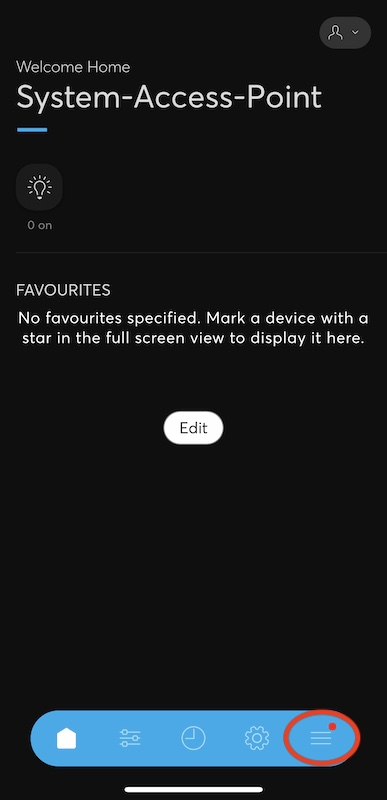
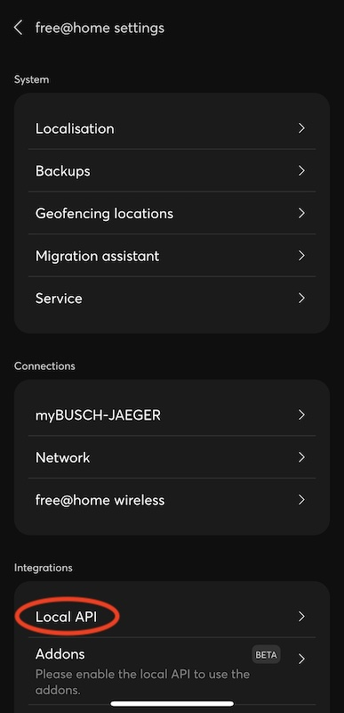
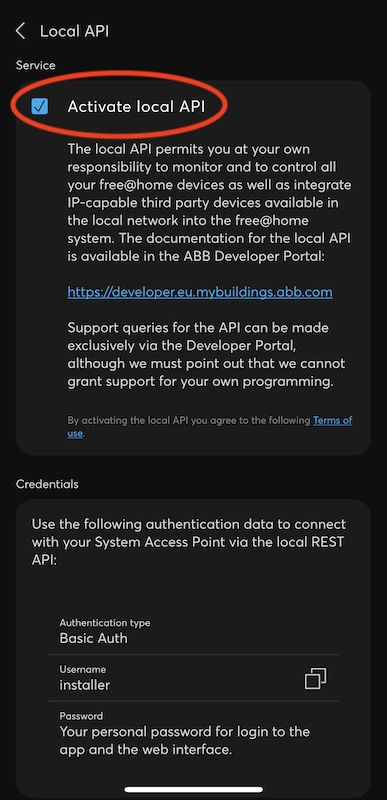

## Prerequisites for developing and using the ABB free@home Addons

------------------------------------------------------------------------

Addons extend the free@home System Access Point with custom functionality. They use the
so-called "Local API" REST interface of the System Access Point to access the current configuration
and data model.
For this, a few prerequisites have to be met by the developer and the end user.

### End user (using addons)

Installing and using addons to the free@home System Access Point requires

- A system access point 2.0 with firmware version at least 3.0.0.

- The free@home next App for a mobile device.

- The system access point must enable the `Activate local API` setting under
  `More -> Installation Settings -> Local API`.

#### Activation of Local API

In order to install an Addon to the free@home System Access Point, the end user must first
enable the local API on the System Access Point using the free@home next App. This API allows to use
some functionality of the System Access Point
using REST calls in the local network of the System Access Point and is used by the Addons to
control and extend the functionality of the System Access Point.

In the free@home next App
([App Store](https://apps.apple.com/de/app/busch-free-home-next/id1501808668),
[Play Store](https://apps.apple.com/de/app/busch-free-home-next/id1501808668)), the user must
enable the `Activate Local API` setting in the System Access Point settings,
found under `More -> Installation Settings -> Local API`.






### Developer (addon development)

To develop a new addon, additional prerequisites are required.

- (Same as for end-users): A system access point with at least version 3.0.0.

- (Same as for end-users): The free@home next App for a mobile device.

- (Same as for end-users): The system access point must enable the `activate local API` setting
  under `More -> free@home Settings -> Local API`.

- The system access point must be available in the local network. Access through the free@home cloud
  is not sufficient. This requirement only applies while developing the addon on a development
  machine. Once an addon is deployed to the system access point, local network access is no longer
  required.

- Basic knowledge of TypeScript.

- `npm` and `node.js` must be installed on the development machine.

  - MacOS:

    ```shell
       brew install npm
    ```

  - Linux (in this example: Ubuntu):

    ```shell
       sudo apt install install npm
    ```

  - Windows: [https://nodejs.org/en/download/](https://nodejs.org/en/download/)

An IDE with support for typescript (ideally a debugger) is recommended - though not required. You
can use any development environment that you are comfortable with, however examples/screenshots in
this documentation use [Visual Studio Code](https://code.visualstudio.com/).